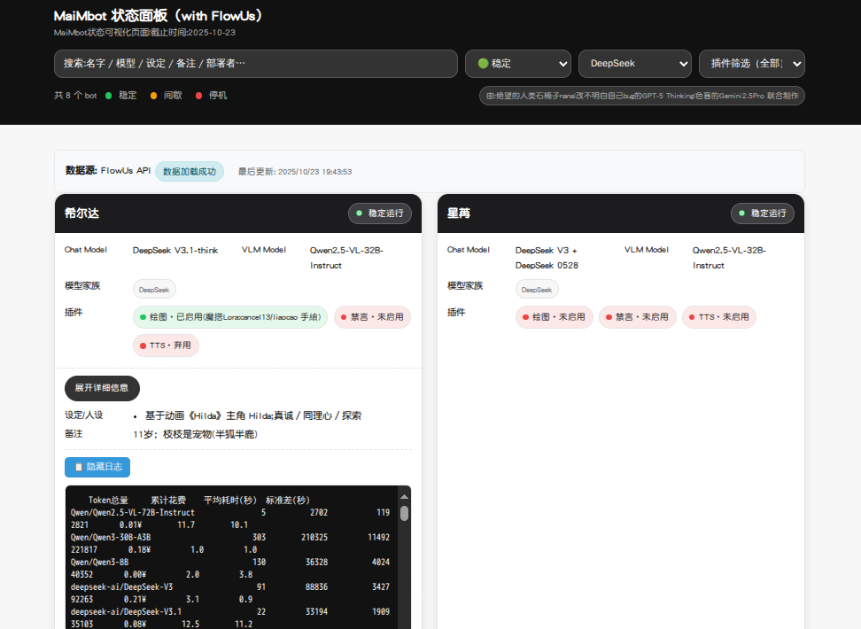
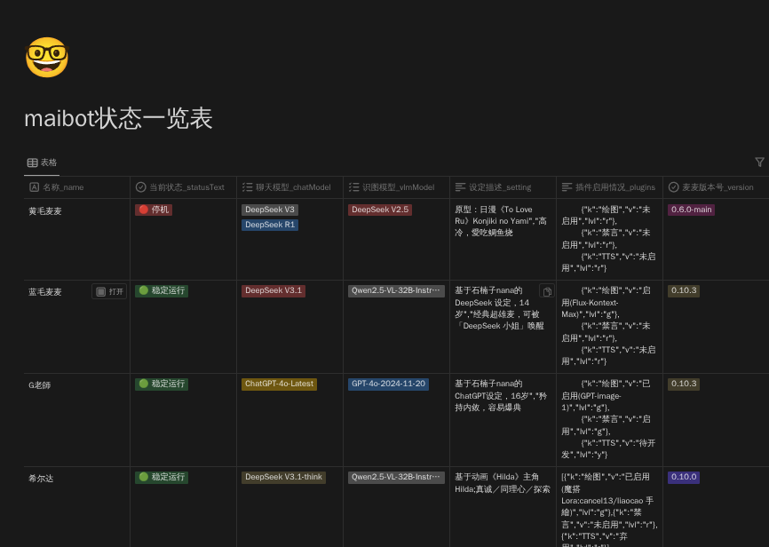

# MaiMbot_web_withlog

一个简单的web用于展示麦麦信息和实时日志，需要手动修改json配置文件,部署涉及的相关内容可能较多，但是很好玩。
[MaiMbotwebwithlog 项目 github 地址](https://github.com/1021143806/MaiMbotwebwithlog)

## 使用方法

### 一、本地

使用 v1_local 中的地址访问
修改 maimbot_status.json 即可修改对应信息

### 二、使用 FlowUs API 作为云端服务器

通过 FlowUs 多维表配置数据，然后使用 API 进行获取数据

- 配置方法

1. 拷贝 [多维表模板链接](https://flowus.cn/jieiyu_painting/share/56640539-712a-4bbd-b0d9-437e069cc25c?code=0YKPXL) 到你自己的空间
2. 在 MaiMbot_status.html 中找到以下配置

    ``` shell
    // FlowUs API 配置
    const FLOWUS_API_URL = 'https://api.flowus.cn/v1/databases/********************************/query';
    const FLOWUS_TOKEN = '****************************************';
    ```

    按照 [Flowus API 文档](https://flowus.cn/share/df7cd54f-1c21-4fc1-9fd8-ce81be1918a5) 修改为自己拷贝后的多维表对应的地址，以及开通后的对应的 token

## 需要的相关软件

1. nginx
用于反向代理网页
2. frp
配合阿里云服务器实现内网穿透
3. supervisor
使用 supervisor 配合源码部署麦麦，然后配合 nginx 反向代理服务，公开日志界面
4. FlowUs (可选)
作为远程服务器端，可多人编辑且实时更新

## 页面展示


